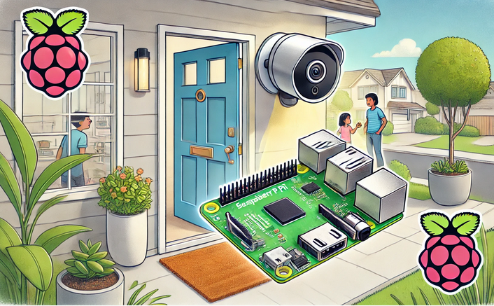

# STEM Objective:  
## Build an IoT-enabled “Smart” Doorbell: <a href="./docs/RingandRun-Final.pdf"> Project pdf </a>

## That will...
- Display streaming video in a Web App when the doorbell button is pressed, or when motion is detected
- Play a customizable doorbell chime
- Provide an intercom system to allow remote communication between the App and the person at the door
- Use Advanced Artificial Intelligence to describe ”who” or “what” is at the door
- Ensure secure/encrypted communication between theDoorbell and the Web App.
- Whatever else you can make it do…
## Using...
- Raspberry Pi 5 running Debian-based Raspberry PI OS (Linux) 
- Electronic components that implement the doorbell device 
- OpenAI GPT-4o model
- Network (Cyber) security protocols and tools
- The Software you develop to make it all work

# Goals...
## Learn, Get Inspired, and Get Involved!
- Learn about advanced technology…
- Raspberry Pi single board computer (SBC) and common uses
- The basics of the Linux operating system
- Basic fundamentals of electronic device prototyping
- Internet of Things (IoT) related technologies and tools 
- Explore/discover and learn programming fundamentals using: Python, JavaScript, CSS (Cascading Style Sheets), and HTML 5
- Discover network protocols, methods, and tools for secure network communication: TCP/IP, HTTP, MQTT, PKI, HTTPS(TLS), etc.
- Explore the latest in Artifical Intelligence by integrating OpenAI's (Chat GPT) services and models

 ## Outcomes:
- Get inspired, discover your talents, perhaps go to university and pursue a high technology career.
- Do Great things!
- Enjoy what you do!

 
